<div align="center">


# Prismatic — Claude Code Status Line

**A prismatic, highly customizable, zero-dependency status line for [Claude Code](https://code.claude.com) — truecolor gradient model pills, a color-coded context bar, and a live visual config editor.**

[](https://github.com/XyzElias/prismatic-claude-statusline/actions/workflows/ci.yml)
[](LICENSE)


[](https://github.com/XyzElias/prismatic-claude-statusline/stargazers)


</div>

## What is this?

Claude Code lets you replace the bar at the bottom of the screen with the output of any script. This is a single, self-contained Node.js script (`statusline.js`) that turns that bar into a row of **gradient "pills"** showing your model, working directory, context-window usage, subscription usage, session diff, cost, and elapsed time — wrapped in a rounded frame.

<div align="center">

<br>
<em>Pills for model, path, context, usage, diff, cost and time — in a rounded frame.</em>
</div>

- **No dependencies.** One `.js` file. No `npm install`, no packages, nothing to keep updated.
- **No API tokens used.** The status line runs locally; it never calls the API.
- **Reliable by design.** Every pill is driven by data Claude Code actually provides. (See [Why there is no monthly-budget pill](#why-no-monthly-budget-pill).)
- **Configure it visually.** Open `config-editor.html` in your browser, drag the segments around, pick colors, and copy the generated config — with a live preview.

## Features

- 🎨 **Per-model gradient themes** — the model name is tinted with a two-color gradient, so you can tell Opus from Sonnet from Haiku from Fable at a glance.
- 📊 **Color-coded context bar** — green when you have room, shading through yellow and orange to red as the context window fills.
- 📈 **Subscription usage** — shows your Claude Pro/Max 5-hour rate-limit percentage and reset time. Automatically hidden on API / pay-per-use plans.
- ✏️ **Session diff & cost** — lines added/removed and the estimated cost of the current session.
- 🧩 **Fully configurable** — reorder, rename, enable/disable any segment; tweak every color; pick a frame style. By hand in YAML, or with the included visual editor.
- 🔤 **Three rendering styles** — `nerd` (Powerline glyphs), `unicode` (works everywhere), or `ascii` (maximum compatibility).

## Gallery

<div align="center">


<br><br>


&nbsp;


</div>

## Quick start

You need [Claude Code](https://code.claude.com) and [Node.js](https://nodejs.org) (which you almost certainly already have). `~` below means your home folder — see [the installation guide](docs/installation.md) if you're unsure where that is.

**1. Put `statusline.js` in your `~/.claude/` folder.** Pick the line for your shell:

```bash
# macOS / Linux / Git Bash
curl -fsSL https://raw.githubusercontent.com/XyzElias/prismatic-claude-statusline/main/statusline.js -o ~/.claude/statusline.js
```

```powershell
# Windows PowerShell  (in PowerShell, "curl" is an alias for Invoke-WebRequest,
# so use curl.exe — or the Invoke-WebRequest form below)
curl.exe -fsSL https://raw.githubusercontent.com/XyzElias/prismatic-claude-statusline/main/statusline.js -o "$HOME\.claude\statusline.js"

# …or the native PowerShell command:
Invoke-WebRequest -Uri "https://raw.githubusercontent.com/XyzElias/prismatic-claude-statusline/main/statusline.js" -OutFile "$HOME\.claude\statusline.js"
```

```bat
:: Windows CMD
curl -fsSL https://raw.githubusercontent.com/XyzElias/prismatic-claude-statusline/main/statusline.js -o "%USERPROFILE%\.claude\statusline.js"
```

(Or just download [`statusline.js`](statusline.js) from this repo and drop it in `~/.claude/` — no terminal needed.)

**2. Point Claude Code at it.** Add this to `~/.claude/settings.json`:

```json
{
  "statusLine": {
    "type": "command",
    "command": "node ~/.claude/statusline.js"
  }
}
```

**3. Restart Claude Code.** That's it. ✨

On first run, the script sets everything up for you in `~/.claude/`:
- **`statusline_config.yml`** — the config file (with sensible defaults).
- **`config-editor.html`** — the [visual config editor](#configuration), bundled right inside `statusline.js`, so it's there without any extra download.

So a single command is all you need. Want the rounded Powerline pill caps in the hero image? See the [Nerd Font guide](docs/nerd-fonts.md) — or stay on the default `unicode` style, which needs no special font.

> **Open the editor any time:** double-click `~/.claude/config-editor.html`, or run `start ~/.claude/config-editor.html` (Windows) / `open ~/.claude/config-editor.html` (macOS) / `xdg-open ~/.claude/config-editor.html` (Linux).

> **Windows:** the command above works as-is if you have Git Bash installed (the default for most Claude Code users on Windows). If you only have PowerShell, see the [installation guide](docs/installation.md#windows) for the one-line alternative.

## Anatomy

<div align="center">

</div>

| # | Segment | What it shows | Source |
|---|---------|---------------|--------|
| 1 | **MODEL** | Active model name, tinted by a per-model gradient | `model.display_name` |
| 2 | **PATH** | Working directory (last *N* folders) | `workspace.current_dir` |
| 3 | **CONTEXT** | Context window used, with a color-coded bar | `context_window.used_percentage` |
| 4 | **USAGE** | Pro/Max rate-limit % + reset time *(hidden on API plans)* | `rate_limits.five_hour` |
| 5 | **DIFF** | Lines added / removed this session | `cost.total_lines_*` |
| 6 | **COST** | Estimated cost of the **current session** | `cost.total_cost_usd` |
| 7 | **TIME** | Session duration | `cost.total_duration_ms` |

Every segment can be reordered, renamed, or turned off. See [Configuration](docs/configuration.md).

## Configuration

Two ways to configure:

- **Visual editor (recommended):** `statusline.js` writes `config-editor.html` into `~/.claude/` on first run, so it's already on your machine — just open it in any browser (no install, nothing to run). Drag to reorder segments, toggle them on/off, pick colors and per-model gradients, and watch a **live preview** update as you go. Click **Copy YAML** and save it to `~/.claude/statusline_config.yml`. *(The standalone [`config-editor.html`](config-editor.html) also lives in this repo.)*
- **By hand:** edit `~/.claude/statusline_config.yml` directly. Every option is documented in [`docs/configuration.md`](docs/configuration.md) and in the comments of the file itself.

<div align="center">

<br>
<em>The bundled visual editor — live preview on top, drag-to-reorder segments, color pickers and model gradients below.</em>
</div>

Changes take effect on your next interaction with Claude Code.

## Documentation

| Guide | What's inside |
|-------|---------------|
| [Installation](docs/installation.md) | Step-by-step setup for macOS, Linux and Windows; where `~/.claude` is; how to verify it works |
| [Configuration](docs/configuration.md) | Every option explained — styles, segments, colors, model gradients, thresholds, frame |
| [Nerd Fonts](docs/nerd-fonts.md) | What a Nerd Font is, how to install one per OS, how to set your terminal font — or skip it entirely |
| [Troubleshooting](docs/troubleshooting.md) | Blank status line, garbled symbols, `~` on Windows, colors not showing, and more |

## How it works

Claude Code pipes a JSON blob describing the current session to your status line command on **stdin** after each message. `statusline.js` reads that JSON, builds the colored pills using [ANSI truecolor escape codes](https://en.wikipedia.org/wiki/ANSI_escape_code#24-bit), and prints them. Claude Code displays whatever the script prints.

This means the status line:

- **uses no API tokens** and adds no latency to your requests — it's pure local rendering;
- needs **no dependencies** — only Node.js, which Claude Code already relies on;
- shows only data Claude Code actually sends, so nothing is faked or estimated beyond what the editor itself estimates.

The exact JSON schema is documented by Anthropic in the [official status line docs](https://code.claude.com/docs/en/statusline).

### Why no monthly-budget pill?

Earlier versions of this status line tried to track a **monthly API budget**. That has been removed on purpose. Claude Code only reports the cost of the **current session** (`cost.total_cost_usd`), and even that is a client-side estimate that "may differ from your actual bill." There is no field for cumulative or monthly spend, so any "monthly budget" number had to be stitched together from per-session estimates in a local file — which drifted and was frequently wrong.

Instead, this status line shows two things it *can* report accurately:

- **USAGE** — your real Pro/Max rate-limit percentage and reset time, straight from Claude Code (for subscribers).
- **COST** — the honest, clearly-labeled estimated cost of the current session.

If you want to watch your spend over time, use the [Anthropic Console](https://console.anthropic.com) usage dashboard — it's the source of truth.

## Compatibility

- **Claude Code** with status line support (any recent version).
- **Node.js** 14+ (any version Claude Code runs with is fine).
- **Terminal** with truecolor (24-bit) support — virtually all modern terminals: Windows Terminal, iTerm2, Kitty, WezTerm, Alacritty, VS Code's terminal, GNOME Terminal, and more.

## Contributing

Issues and pull requests are welcome — color themes, extra segments, and platform fixes especially. The status line logic is one readable file (`statusline.js`); the visual editor is `config-editor.html`. Two small build helpers keep things in sync:

- [`tools/render-svg.js`](tools/render-svg.js) regenerates the README images (`node tools/render-svg.js`).
- [`tools/embed-editor.js`](tools/embed-editor.js) re-embeds `config-editor.html` into `statusline.js` as a base64 blob (`node tools/embed-editor.js`) — **run this after editing the editor**, so a single `statusline.js` download keeps carrying the latest editor. (The blob lives at the very bottom of `statusline.js`; everything above it is the normal, readable logic.)

## License

[MIT](LICENSE) © Elias Felder
